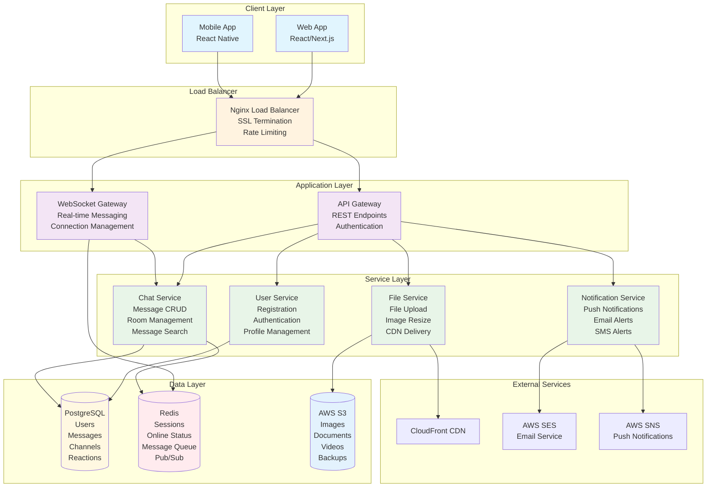

```mermaid
graph TB
    subgraph "Client Layer"
        WA[Web App<br/>React/Next.js]
        MA[Mobile App<br/>React Native]
    end
    
    subgraph "Load Balancer"
        LB[Nginx Load Balancer<br/>SSL Termination<br/>Rate Limiting]
    end
    
    subgraph "Application Layer"
        AG[API Gateway<br/>REST Endpoints<br/>Authentication]
        WS[WebSocket Gateway<br/>Real-time Messaging<br/>Connection Management]
    end
    
    subgraph "Service Layer"
        US[User Service<br/>Registration<br/>Authentication<br/>Profile Management]
        CS[Chat Service<br/>Message CRUD<br/>Room Management<br/>Message Search]
        FS[File Service<br/>File Upload<br/>Image Resize<br/>CDN Delivery]
        NS[Notification Service<br/>Push Notifications<br/>Email Alerts<br/>SMS Alerts]
    end
    
    subgraph "Data Layer"
        PG[(PostgreSQL<br/>Users<br/>Messages<br/>Channels<br/>Reactions)]
        RD[(Redis<br/>Sessions<br/>Online Status<br/>Message Queue<br/>Pub/Sub)]
        S3[(AWS S3<br/>Images<br/>Documents<br/>Videos<br/>Backups)]
    end
    
    subgraph "External Services"
        CDN[CloudFront CDN]
        SES[AWS SES<br/>Email Service]
        SNS[AWS SNS<br/>Push Notifications]
    end
    
    WA --> LB
    MA --> LB
    LB --> AG
    LB --> WS
    AG --> US
    AG --> CS
    AG --> FS
    AG --> NS
    WS --> CS
    WS --> RD
    US --> PG
    CS --> PG
    CS --> RD
    FS --> S3
    NS --> SES
    NS --> SNS
    FS --> CDN
    
    style WA fill:#e1f5fe
    style MA fill:#e1f5fe
    style LB fill:#fff3e0
    style AG fill:#f3e5f5
    style WS fill:#f3e5f5
    style US fill:#e8f5e8
    style CS fill:#e8f5e8
    style FS fill:#e8f5e8
    style NS fill:#e8f5e8
    style PG fill:#fff8e1
    style RD fill:#ffebee
    style S3 fill:#e3f2fd
```
